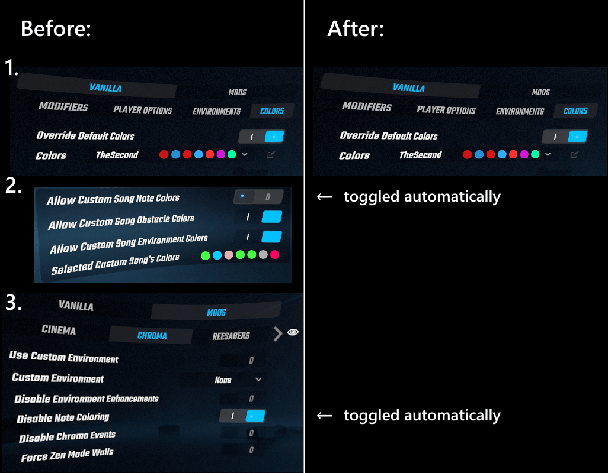

# NoteColorForceOverride

Simple Beat Saber mod to automatically disable custom note colors from SongCore and Chroma when "override default colors" is enabled, and re-enable them when override is disabled.

